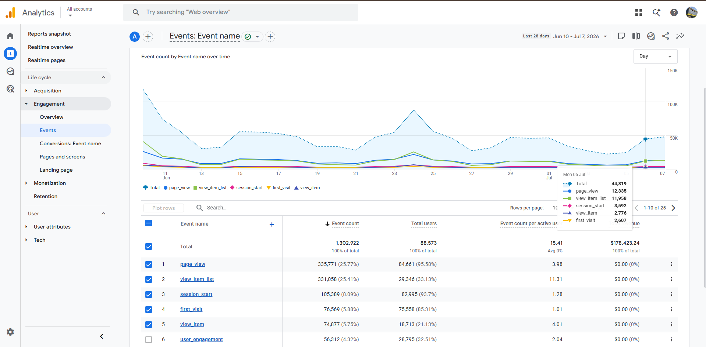
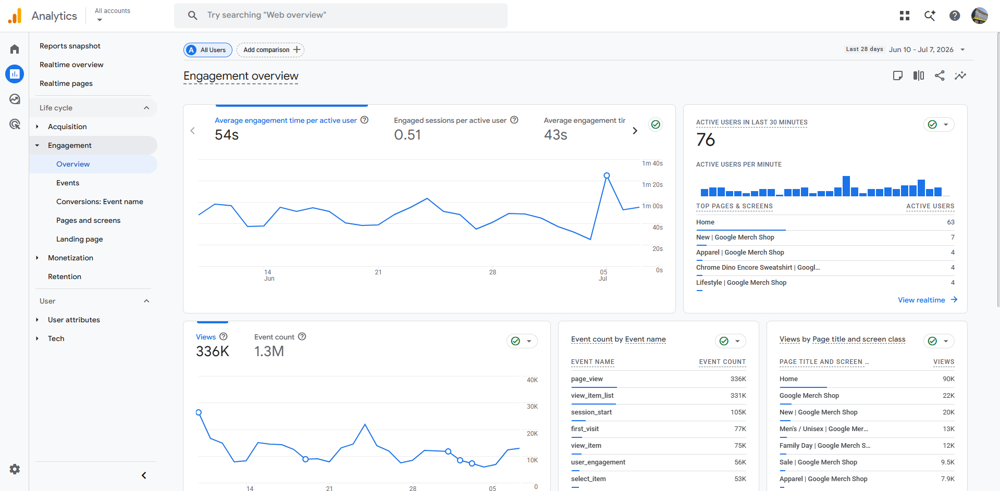

```{r}
library(tidyverse)
library(scales)

ga4_summary <- tibble::tribble(
  ~metric, ~value,
  "Date range", "Jun 10 – Jul 7, 2026",
  "Total users", "88,573",
  "Total event count", "1,302,922",
  "Event count per active user", "15.41",
  "Total revenue", "$178,423.24",
  "Views", "336K",
  "Average engagement time per active user", "54 seconds",
  "Engaged sessions per active user", "0.51",
  "Average engagement time", "43 seconds",
  "Active users in last 30 minutes", "76"
)

event_data <- tibble::tribble(
  ~event_name, ~event_count, ~total_users, ~event_count_per_active_user,
  "page_view", 335771, 84661, 3.98,
  "view_item_list", 331058, 29346, 11.31,
  "session_start", 105389, 82995, 1.28,
  "first_visit", 76569, 75558, 1.01,
  "view_item", 74877, 18713, 4.01,
  "user_engagement", 56312, 28795, 2.04,
  "select_item", 53000, NA, NA
)

top_pages <- tibble::tribble(
  ~page_title, ~views,
  "Home", 90000,
  "Google Merch Shop", 22000,
  "New | Google Merch Shop", 20000,
  "Men's / Unisex | Google Merch Shop", 13000,
  "Family Day | Google Merch Shop", 12000,
  "Sale | Google Merch Shop", 9500,
  "Apparel | Google Merch Shop", 7900
)

realtime_pages <- tibble::tribble(
  ~page_title, ~active_users,
  "Home", 63,
  "New | Google Merch Shop", 7,
  "Apparel | Google Merch Shop", 4,
  "Chrome Dino Encore Sweatshirt | Google Merch Shop", 4,
  "Lifestyle | Google Merch Shop", 4
)
```

## GA4 Overview

Google Analytics 4 was used to review website engagement, event activity, page performance, traffic behavior, and revenue-related performance. The screenshots below show the GA4 Engagement Overview and Events reports for the last 28 days.

---

## GA4 Report Screenshots





---

## Key Metrics Summary

```{r}
knitr::kable(ga4_summary)
```

---

## Top Events by Event Count

```{r}
event_data |>
  filter(!is.na(event_count)) |>
  ggplot(aes(x = reorder(event_name, event_count), y = event_count)) +
  geom_col() +
  coord_flip() +
  scale_y_continuous(labels = comma_format()) +
  labs(
    title = "Top GA4 Events by Event Count",
    x = "Event Name",
    y = "Event Count",
    caption = "Source: GA4 screenshots, Jun 10 – Jul 7, 2026"
  ) +
  theme_minimal()
```

---

## Event Count per Active User

```{r}
event_data |>
  filter(!is.na(event_count_per_active_user)) |>
  ggplot(aes(x = reorder(event_name, event_count_per_active_user), y = event_count_per_active_user)) +
  geom_col() +
  coord_flip() +
  labs(
    title = "Event Count per Active User by Event",
    x = "Event Name",
    y = "Event Count per Active User",
    caption = "Source: GA4 screenshots, Jun 10 – Jul 7, 2026"
  ) +
  theme_minimal()
```

---

## Top Pages by Views

```{r}
top_pages |>
  ggplot(aes(x = reorder(page_title, views), y = views)) +
  geom_col() +
  coord_flip() +
  scale_y_continuous(labels = comma_format()) +
  labs(
    title = "Top Pages by Views",
    x = "Page Title",
    y = "Views",
    caption = "Source: GA4 screenshot, rounded values displayed in report"
  ) +
  theme_minimal()
```

---

## Active Users in Last 30 Minutes

```{r}
realtime_pages |>
  ggplot(aes(x = reorder(page_title, active_users), y = active_users)) +
  geom_col() +
  coord_flip() +
  scale_y_continuous(labels = comma_format()) +
  labs(
    title = "Realtime Active Users by Page",
    x = "Page Title",
    y = "Active Users",
    caption = "Source: GA4 engagement overview screenshot"
  ) +
  theme_minimal()
```

---

## Business Insight

- The site had **88,573 total users** and **1,302,922 total events** during the last 28 days.
- The strongest event categories were **page_view** and **view_item_list**.
- The **Home** page had the highest visible page views.
- Engagement was moderate, with **54 seconds average engagement time per active user** and **0.51 engaged sessions per active user**.

---

## Skills Demonstrated

- Google Analytics 4
- Website performance analysis
- Data visualization
- Marketing analytics
- Business insight
- Quarto website development